# Arabic Tokenizers Evaluation — End-to-End Pipeline

**Goal.** Compare Arabic tokenizers under a single, fixed training-and-evaluation pipeline so that the only experimental variable is the tokenizer + its embedding/lm_head weights.

**Design principle.** Training is **task-agnostic**: every condition (native Llama tokenizer + every from-scratch tokenizer variant) executes the same fixed 3-phase pipeline on the same QA corpora, and is then evaluated on the same downstream MCQ benchmarks using the **full** benchmark (no rows reserved for SFT).

---

## 1. Master pipeline (single tokenizer cell)

```mermaid
flowchart TB
    classDef setup fill:#eef,stroke:#446,stroke-width:1px,color:#000
    classDef tok fill:#efe,stroke:#464,color:#000
    classDef intrinsic fill:#fee,stroke:#644,color:#000
    classDef model fill:#fef,stroke:#646,color:#000
    classDef phase fill:#ffd,stroke:#aa4,color:#000
    classDef eval fill:#dff,stroke:#477,color:#000
    classDef out fill:#ddd,stroke:#444,color:#000
    classDef data fill:#fff5e6,stroke:#a60,color:#000,stroke-dasharray:3 3
    classDef decision fill:#fdf,stroke:#606,color:#000

    Start([scripts/run_experiment.py<br/>--config &lt;experiment&gt;.yaml]):::setup

    subgraph S0[Stage 0 — Setup]
        direction TB
        S0a[Set master seed<br/>+ deterministic backends]:::setup
        S0b[Create output_dir<br/>save resolved config.json]:::setup
    end

    subgraph S1[Stage 1 — Main Arabic corpus]
        direction TB
        D1[(Jr23xd23/<br/>ArabicText-Large)]:::data
        S1a[Arabic preprocessing<br/>• NFKC normalize<br/>• alef-variant fold<br/>• tatweel removal<br/>• whitespace collapse<br/>• optional diacritics removal]:::setup
        S1b[Train/eval split<br/>used ONLY for tokenizer<br/>training + intrinsic eval]:::setup
    end

    subgraph S2[Stage 2 — Tokenizer]
        direction TB
        S2q{tokenizer.load_path<br/>set?}:::decision
        S2a[Train from scratch<br/>on train texts]:::tok
        S2b[Load saved tokenizer<br/>from disk]:::tok
        S2c[Save tokenizer<br/>artifacts]:::tok
    end

    subgraph S3[Stage 3 — Intrinsic Evaluation]
        direction TB
        S3a[Size / coverage metrics<br/>fertility, compression,<br/>UNK rate, vocab coverage,<br/>avg token count]:::intrinsic
        S3b[Morphological metrics<br/>RPS, PIS, integrity,<br/>CSA, SFR,<br/>root/pattern bearing-token %]:::intrinsic
        S3c[(Backends:<br/>qalsadi, tashaphyne,<br/>Farasa Java subprocess)]:::data
    end

    subgraph S4[Stage 4 — Model Adapter]
        direction TB
        S4a[Load Llama-3.2-1B<br/>pretrained weights]:::model
        S4b{embedding_type?}:::decision
        S4c[STANDARD<br/>resize_token_embeddings<br/>keeps first-N pretrained rows]:::model
        S4d[CHARACTER_CNN<br/>replace embed + lm_head<br/>with CharCNN modules]:::model
        S4e[CHAR_JABER<br/>replace embed<br/>with char-embedding]:::model
        S4f[CHARFORMER<br/>replace embed with GBST<br/>+ replace lm_head with<br/>upsampling output head]:::model
    end

    subgraph S5[Stage 5 — 3-Phase Training]
        direction TB
        P1["`**Phase 1 — Embedding Alignment**
            body frozen
            train embed_tokens + lm_head only
            full-sequence causal LM
            on Arabic-SQuAD`"]:::phase
        P2["`**Phase 2 — Warmup**
            unfreeze all
            answer-only loss
            on Arabic-SQuAD
            cosine LR + warmup`"]:::phase
        P3["`**Phase 3 — SFT**
            unfreeze all
            answer-only loss
            on TyDiQA-Arabic + ARCD
            cosine + early-stop`"]:::phase
        P1 --> P2 --> P3
    end

    subgraph S6[Stage 6 — Downstream Evaluation]
        direction TB
        S6a[Tokenizer warmup encode<br/>before timer starts<br/>per task]:::eval
        S6b[For each task in sweep.tasks:<br/>load full benchmark]:::eval
        S6c[LightEval log-likelihood<br/>per question + score norm<br/>char / pmi / char+pmi]:::eval
        S6d[Per-sub-config breakdown<br/>+ optional failure CSV]:::eval
    end

    subgraph S7[Stage 7 — Composite Metric]
        direction TB
        S7a[Per-task MEI<br/>= acc × RPS × compression<br/>÷ inference_time_per_row]:::eval
    end

    subgraph S8[Stage 8 — Persist]
        direction TB
        O1[all_metrics.json<br/>config + intrinsic +<br/>training + downstream + mei]:::out
        O2[outputs/.../training/<br/>{embedding_alignment,warmup,sft}/<br/>model.pt checkpoints]:::out
        O3[outputs/.../failure_reports/<br/>per-task CSV<br/>OPT-IN]:::out
    end

    Start --> S0a --> S0b --> D1
    D1 --> S1a --> S1b --> S2q
    S2q -- yes --> S2b
    S2q -- no --> S2a --> S2c
    S2b --> S3a
    S2c --> S3a
    S3a --> S3b
    S3c -.-> S3b
    S3b --> S4a --> S4b
    S4b --> S4c & S4d & S4e & S4f
    S4c & S4d & S4e & S4f --> P1
    P3 --> S6a --> S6b --> S6c --> S6d
    S6d --> S7a --> O1
    P1 -.checkpoint.-> O2
    P2 -.checkpoint.-> O2
    P3 -.best ckpt.-> O2
    S6d -.optional.-> O3
```

---

## 2. The 3-Phase Training Block (zoom-in)

Each phase has its own independently-toggleable `enabled` flag. Phase 3 additionally runs periodic eval on TyDiQA-val + ARCD-val for stagnation early-stop.

```mermaid
flowchart LR
    classDef p1 fill:#ffe6e6,stroke:#a44,color:#000
    classDef p2 fill:#fff5cc,stroke:#a82,color:#000
    classDef p3 fill:#ccf5cc,stroke:#262,color:#000
    classDef data fill:#fff5e6,stroke:#a60,color:#000,stroke-dasharray:3 3
    classDef gate fill:#fdf,stroke:#606,color:#000

    A0([adapted model]):::p1

    subgraph PHASE1[Phase 1 — Embedding Alignment]
        direction TB
        D1[(Mostafa3zazi/<br/>Arabic_SQuAD<br/>train, 48,344 rows)]:::data
        F1[apply_trainable_filter<br/>'embed_tokens', 'lm_head'<br/>body frozen]:::p1
        L1[Full-sequence<br/>causal LM loss]:::p1
        O1[AdamW<br/>LR=1e-3, BS=8<br/>weight_decay=0<br/>constant LR]:::p1
        R1[1000 steps<br/>~20 min on H100]:::p1
        C1[Save ckpt:<br/>training/embedding_alignment/]:::p1
    end

    subgraph PHASE2[Phase 2 — Warmup]
        direction TB
        D2[(Mostafa3zazi/<br/>Arabic_SQuAD<br/>train, 48,344 rows)]:::data
        F2[apply_trainable_filter<br/>'*' = unfreeze all]:::p2
        L2[Answer-only loss<br/>via LCP masking]:::p2
        O2[AdamW<br/>LR=2e-4, BS=4×4<br/>weight_decay=0.01<br/>cosine + 100 warmup]:::p2
        R2[2000 steps<br/>~43 min on H100]:::p2
        C2[Save ckpt:<br/>training/warmup/]:::p2
    end

    subgraph PHASE3[Phase 3 — SFT]
        direction TB
        D3a[(google-research-datasets/<br/>tydiqa secondary_task<br/>Arabic train, 14,805 rows)]:::data
        D3b[(hsseinmz/arcd plain_text<br/>train, 693 rows)]:::data
        F3[apply_trainable_filter<br/>'*' = unfreeze all]:::p3
        L3[Answer-only loss<br/>via LCP masking]:::p3
        O3[AdamW<br/>LR=2e-4, BS=4×4<br/>weight_decay=0.01<br/>cosine + 100 warmup]:::p3
        E3{eval every<br/>200 steps on<br/>TyDiQA-val + ARCD-val}:::gate
        S3[Stagnation early-stop<br/>patience=5,<br/>min_delta=5e-4,<br/>min_steps_before_stop=500]:::p3
        B3[Restore best by eval_loss]:::p3
        R3[≤2000 steps<br/>~3.2 h on H100]:::p3
        C3[Save best ckpt:<br/>training/sft/]:::p3
    end

    A0 --> D1 --> F1 --> L1 --> O1 --> R1 --> C1
    C1 --> D2 --> F2 --> L2 --> O2 --> R2 --> C2
    C2 --> D3a & D3b
    D3a & D3b --> F3 --> L3 --> O3 --> E3
    E3 -- improving --> O3
    E3 -- plateau --> S3 --> B3 --> R3 --> C3
    O3 -- step budget --> R3
```



**Per-phase configurable knobs** (every field overridable from YAML):
`enabled`, `datasets`, `trainable_parameters`, `steps`, `learning_rate`, `batch_size`, `gradient_accumulation_steps`, `optimizer`, `weight_decay`, `max_length`, `loss_target`, `lr_scheduler`, `warmup_steps`, `max_grad_norm`, `save_checkpoint`. Phase 3 also has the full `early_stopping` block.

**"With SFT" vs "Without SFT".**
- *With SFT*: all three phase `enabled = true`. Reference: `configs/experiments/native_llama_3phase_with_sft.yaml`.
- *Without SFT*: Phase 1 + Phase 2 enabled, **Phase 3 disabled**. Lets us isolate Phase 3's contribution: `(with_sft − no_sft)` per benchmark. Reference: `configs/experiments/native_llama_3phase_no_sft.yaml`.

---

## 3. Downstream Evaluation Branching (zoom-in)

Eval iterates over every task in `sweep.tasks` against the **full benchmark** (no SFT split). Per-task scoring branches on the task's own hooks.

```mermaid
flowchart TB
    classDef common fill:#dff,stroke:#477,color:#000
    classDef branch fill:#ffd,stroke:#aa4,color:#000
    classDef out fill:#ddd,stroke:#444,color:#000
    classDef data fill:#fff5e6,stroke:#a60,color:#000,stroke-dasharray:3 3
    classDef gate fill:#fdf,stroke:#606,color:#000

    M0([Trained model<br/>after Phase 3]):::common

    subgraph PerTask[Per task in sweep.tasks]
        direction TB
        T0[Tokenizer warmup encode<br/>warm CAMeL/Farasa subprocesses]:::common
        T1[Start timer<br/>time.perf_counter]:::common
        T2[Load benchmark via HF<br/>get_eval_examples<br/>full benchmark, no SFT split]:::common
        T3{score_normalization<br/>config?}:::gate

        subgraph CHAR[char mode]
            C1[ll = log-prob sum<br/>over continuation tokens]:::branch
            C2[score = ll / len(continuation)]:::branch
        end
        subgraph PMI[pmi mode]
            P1[unconditioned ll<br/>= log P(c | bare prompt)]:::branch
            P2[score = full_ll − unconditioned_ll]:::branch
        end
        subgraph BOTH[char+pmi mode]
            B1[Compute both]:::branch
            B2[accuracy_char_norm<br/>+ accuracy_pmi]:::branch
        end

        T4{task is multi<br/>sub-config?}:::gate
        T5[Bucket correct/total<br/>by _source_config]:::common
        T6[Aggregate accuracy]:::common

        T7{evaluation.failure<br/>_reports?}:::gate
        T8[Write per-task<br/>accuracy_failures.csv<br/>opt-in]:::branch

        T9[End timer<br/>inference_time_sec]:::common

        T10[compute_mei<br/>= acc × RPS × compression<br/>× num_eval_rows<br/>÷ inference_time_sec]:::common
    end

    O1[downstream.<task>:<br/>{accuracy, num_samples,<br/>per_subconfig_accuracy,<br/>inference_time_sec, ...}]:::out
    O2[mei.<task>:<br/>{mei, status, inputs}]:::out

    M0 --> T0 --> T1 --> T2 --> T3
    T3 -- char --> C1 --> C2
    T3 -- pmi --> P1 --> P2
    T3 -- char+pmi --> B1 --> B2
    C2 & P2 & B2 --> T4
    T4 -- yes --> T5
    T4 -- no --> T6
    T5 --> T6
    T6 --> T7
    T7 -- yes --> T8
    T7 -- no --> T9
    T8 --> T9
    T9 --> T10
    T10 --> O1
    T10 --> O2
```

**The four eval tasks** (LightEval log-likelihood MCQ, registered task keys):

| Task | Default dataset | Shape | Continuations |
|---|---|---|---|
| `acva` | `OALL/ACVA` (58 cultural sub-configs) | 2-way T/F | word-scored: `" صح"` / `" خطأ"` (avoids letter-prior collapse) |
| `alghafa` | `OALL/AlGhafa-Arabic-LLM-Benchmark-Native` (9 sub-configs) | 2/3/4/5-way per-sub-config | per-row dispatch: word-scored for binary/sentiment, letter-scored for 4/5-way MCQ |
| `culture_arabic_mmlu` | `OALL/Arabic_MMLU` (single config) | 4-way MCQ | letter-scored `أ/ب/ج/د` |
| `arabic_exam` | `MBZUAI/ArabicMMLU` (40 subject configs, `All` excluded) | 4 or 5-way MCQ | letter-scored, with optional `Context` field |

---

## 4. Sweep Mode (multiple tokenizer cells)

```mermaid
flowchart LR
    classDef cell fill:#eef,stroke:#446,color:#000
    classDef out fill:#ddd,stroke:#444,color:#000

    Sweep[run_sweep<br/>--config &lt;sweep&gt;.yaml]:::cell

    subgraph C1[Cell: tokenizer A, vocab 16k]
        direction TB
        C1a[Stages 1-7<br/>= run_experiment]:::cell
    end
    subgraph C2[Cell: tokenizer A, vocab 32k]
        C2a[Stages 1-7]:::cell
    end
    subgraph CN[Cell: tokenizer N, vocab ...]
        CNa[Stages 1-7]:::cell
    end

    R1[outputs/&lt;sweep&gt;/A_16k/<br/>all_metrics.json]:::out
    R2[outputs/&lt;sweep&gt;/A_32k/<br/>all_metrics.json]:::out
    RN[outputs/&lt;sweep&gt;/N_.../<br/>all_metrics.json]:::out

    REPORT[outputs/&lt;sweep&gt;/<br/>comparison_report.{txt,json}<br/>cross-cell summary<br/>+ MEI table<br/>+ per-sub-config breakdown<br/>+ flags for mechanical extremes]:::out

    Sweep --> C1 & C2 & CN
    C1a --> R1
    C2a --> R2
    CNa --> RN
    R1 & R2 & RN --> REPORT
```

Training happens **once per cell** (one tokenizer, one vocab size). The eval task list is shared — each cell evaluates the same trained model on every task in `sweep.tasks`.

Resume semantics: if `outputs/<sweep>/<cell>/all_metrics.json` already exists, that cell is skipped. Useful for re-running after a crash.

---

## 5. Considerations & design rationale

These are the choices we **deliberately made**, with the reason behind each.

### 5.1 Why a fixed 3-phase pipeline (not per-benchmark SFT)

Previously, training did "10 % SFT on benchmark + 90 % eval". That setup was **destructive for from-scratch tokenizers**: HF's `resize_token_embeddings` silently maps the first N vocab indices onto Llama's first N pretrained rows when `new_vocab ≤ old_vocab`, so a from-scratch BPE-32K's token ID 5 inherits Llama's pretrained ID 5 row (which is the ASCII character `#`). 10 % benchmark-specific SFT can't drift those mappings far enough to find real signal — accuracy plateaus near majority-class.

The 3-phase pipeline:
1. **Phase 1** deliberately drifts those embeddings on a large generic Arabic corpus, with the body frozen so all the gradient flows into the embedding/lm_head matrix.
2. **Phase 2** unfreezes everything and continues on the same regular dataset to teach QA format.
3. **Phase 3** does the decisive SFT on **native Arabic QA** — TyDiQA + ARCD — *without* using any rows from the eval benchmarks. This makes training apples-to-apples across all conditions and the eval set is the entire benchmark.

### 5.2 Why answer-only loss in Phases 2 + 3 — and via LCP, not length

Both phases want the gradient to focus on the answer span (we're not trying to model the question). Naive `labels[:len(prompt_enc)] = -100` is a trap: many tokenizers (including Llama) auto-append `</s>` to standalone prompt encodings, so:
- `prompt_enc[P-1] = EOS`, but
- `full_enc[P-1] = first answer token`.

Length-based masking eats the first answer token. We use **longest-common-prefix** between the two encodings instead, which tolerates any end-of-string artifacts. Single source of truth: `compute_answer_only_labels` in [`src/arabic_eval/data/answer_only_masking.py`](src/arabic_eval/data/answer_only_masking.py).

### 5.3 Why full-sequence loss in Phase 1

Phase 1 is about aligning random embeddings to the Arabic distribution, not learning task format. Full-sequence causal LM loss gives the embedding/lm_head matrix the most signal per step.

### 5.4 Why the Llama tied-embeddings warning is not a bug

Llama-3.2-1B has `lm_head.weight is model.embed_tokens.weight` — they are literally the same tensor. So `lm_head` doesn't appear in `named_parameters()`. Phase 1's `trainable_parameters: ["embed_tokens", "lm_head"]` is still semantically correct: the freezing helper warns when a substring matches no parameter while another does (the tied case) and continues. Training `embed_tokens` IS training `lm_head`. Keeping both substrings means a future model with **untied** weights will train the right thing without YAML changes.

### 5.5 Why eval is full-benchmark (no held-out split)

Under task-agnostic SFT, the benchmark contributes 0 rows to training. So 100 % of rows are usable for eval. This:
- doubles or triples eval-set sizes (matters for tail sub-configs),
- removes the need for a stratified 10/90 split + per-config seed (deleted),
- makes results directly comparable across runs (no split nondeterminism).

### 5.6 Why per-task MEI

MEI = `accuracy × root_conservation_rate × compression_ratio × num_eval_rows / inference_time_sec` — equivalently, accuracy × intrinsic-quality-signal divided by **per-row** inference time. The per-row form is invariant under dataset size, so cross-task MEI is meaningful. Computed per task because each task has its own accuracy + inference time + row count; the intrinsic factors (RPS, compression) are tokenizer-only and shared across tasks.

The `RPS_MECHANICAL_FLAGS` table in `evaluation/reporter.py` flags tokenizers whose RPS is mechanical (CharBERT/AraRooPat at the ceiling, char-JABER/Charformer at the floor) so a reader doesn't conclude that a tokenizer is "the best for Arabic morphology" when it's just hitting an architectural extreme.

### 5.7 Why score-normalization is a knob

Default `"char"` (LightEval `LogProbCharNorm` equivalent) divides each continuation's log-likelihood by its character length — fixes the bias-toward-shorter-answers that summed log-probs introduce. For 1-char letter-MCQ this is a no-op; for word-scored ACVA / Alghafa it materially shifts results.

`"pmi"` (LightEval `LogProbPMINorm` equivalent) subtracts the unconditioned per-continuation log-likelihood — fixes the per-letter / per-word **prior bias** that dominates weak-signal letter-MCQ on translated benchmarks. Llama's unconditional log P(letter | empty MCQ context) spans ~1.7 nats across `أ/ب/ج/د`; on a translated MMLU benchmark this prior fully dominates the question signal.

`"char+pmi"` reports both. Use this if you want to compare across normalization regimes in one run.

### 5.8 Why the warmup encode before each timer

AraRooPat uses a CAMeL-tools subprocess (cold-start ~1–2 s) and Farasa-based tokenizers spawn a Java subprocess on first call. Without a pre-timer warmup, that startup gets billed to the timed eval region and unfairly inflates `inference_time_sec` for morphology-aware tokenizers — i.e., it crushes their MEI denominator. We warm via `tokenizer.encode("نص قصير للإحماء")` before `time.perf_counter()` starts.

### 5.9 Why the Alghafa per-sub-config dispatch matters

Alghafa's 9 sub-configs span 2/3/4/5-way MCQ. The 4 binary / sentiment configs collapse to majority-class under letter-based `أ/ب` scoring (the letter-prior pathology). They use **word-scored** prompts instead. The 4-way and 5-way MCQ configs keep letter-scoring. Dispatch is per-row, keyed on `_source_config`, controlled by `AlghafaTask.WORD_SCORED_CONFIGS` (single source of truth — to add another word-scored sub-config, edit that frozenset).

### 5.10 Why ACVA word-scoring (and the dagger flag)

ACVA's letter-scoring pathology: the continuation pool was just `صح` / `خطأ` rendered as `أ` / `ب`, so 99 % of decisions were near-tie log-likelihoods dominated by the letter prior. ACVA scores the words directly to fix this. **However**, ACVA's gold labels are also synthetically generated and ship with non-trivial noise (~30 % duplicates, 51 within-eval label conflicts, factually-wrong labels in some rows). The sweep `comparison_report.txt` flags ACVA with a dagger `†` and a footnote so consumers know to cross-validate against the other three benchmarks.

### 5.11 Why Latin-script row filtering is opt-in

Some Arabic benchmarks have a long tail of rows whose questions / choices are mostly Latin script (e.g. equation rendering, English loanwords). `clean_latin_rows: true` (per task) drops these before eval. Off by default — most tokenizer comparisons want the full benchmark.

---

## 6. Configuration knobs (the surface area users actually tune)

Knobs appear at three levels, with later layers overriding earlier:

```
configs/base.yaml              ← defaults for every field (inc. all 3 phases)
   ↓
configs/experiments/<exp>.yaml ← per-experiment deltas (tokenizer choice,
                                  per-phase overrides, eval task list)
   ↓
CLI flags                       ← --seed, --device
```

### Top-level fields per experiment YAML

| Block | Fields |
|---|---|
| `experiment` | name, output_dir, seed, deterministic |
| `data` | dataset_name, max_train_samples, max_eval_samples, preprocessing.{normalize_unicode,remove_diacritics,min_text_length} |
| `tokenizer` | type, vocab_size, params, save_path, load_path |
| `model` | type, name_or_path, dtype, device |
| `training` | bf16, fp16, logging_steps, **phases.{embedding_alignment,warmup,sft}** |
| `evaluation` | intrinsic_metrics, morphological_metrics, morph_sample_size, downstream_metrics, num_eval_samples, failure_reports, score_normalization |
| `sweep` | tokenizers (list of {type, vocab_sizes, params}), tasks (list of {type, params}) |

### Per-phase fields (under `training.phases.<phase>`)

| Field | Type | Purpose |
|---|---|---|
| `enabled` | bool | per-phase on/off |
| `datasets` | list of `arabic_squad` / `tydiqa_arabic` / `arcd` | corpus list (concatenated) |
| `trainable_parameters` | list of substrings | filter against `named_parameters()`. `["*"]` = all. |
| `steps`, `learning_rate`, `batch_size`, `gradient_accumulation_steps` | scalars | step budget + optimizer LR + effective batch |
| `optimizer` | `"adamw"` | only AdamW supported |
| `weight_decay`, `max_grad_norm`, `max_length` | scalars | regularization + sequence cap |
| `loss_target` | `"full_sequence"` / `"answer_only"` | mask everything except answer span (LCP) |
| `lr_scheduler` | `"cosine"` / `"constant"` / `"linear"` | post-warmup decay shape |
| `warmup_steps` | int | linear LR warmup |
| `save_checkpoint` | bool | persist `{phase}/model.pt` |
| `early_stopping` (SFT only) | nested config | metric, eval_every_n_steps, patience, min_delta, min_steps_before_stop, restore_best_at_end, eval_splits |

A fully-documented template is at [`configs/experiments/sample_full.yaml`](configs/experiments/sample_full.yaml).

---

## 7. Output structure (per experiment)

```
outputs/experiments/<experiment_name>/
├── config.json                             # Full resolved config (for reproducibility)
├── intrinsic_metrics.json                  # Stage 3 results
├── all_metrics.json                        # Aggregated:
│                                            #   • config
│                                            #   • intrinsic
│                                            #   • training.{embedding_alignment, warmup, sft}
│                                            #     (per-phase: status, steps_completed, final_loss,
│                                            #      best_eval_loss, early_stopped, checkpoint_path,
│                                            #      wall_time_sec, train_losses_tail, eval_losses)
│                                            #   • downstream.<task> (per-task accuracy +
│                                            #     per_subconfig_accuracy + inference_time_sec)
│                                            #   • mei.<task> (per-task MEI + inputs + status)
├── training/
│   ├── embedding_alignment/model.pt
│   ├── warmup/model.pt
│   └── sft/model.pt                        # Best by eval_loss, restored at end
└── failure_reports/                         # OPT-IN: evaluation.failure_reports=true
    ├── acva_accuracy_failures.csv
    ├── alghafa_accuracy_failures.csv
    └── ...
```

Sweep mode adds `comparison_report.{txt,json}` at `outputs/<sweep>/`.

---

## 8. Two reference experiments

| Experiment | Phase 1 | Phase 2 | Phase 3 | Eval tasks | Wall time on H100 |
|---|---|---|---|---|---|
| `native_llama_3phase_with_sft.yaml` | ✓ | ✓ | ✓ | ACVA + Alghafa + arabic_exam | ~5 h |
| `native_llama_3phase_no_sft.yaml` | ✓ | ✓ | — (disabled) | ACVA + Alghafa + arabic_exam | ~1.5 h |

The `(with_sft − no_sft)` delta per benchmark is the empirical contribution of Phase 3 (native-Arabic SFT) to downstream MCQ accuracy.

When new tokenizers are added, run them through the same two configs (overriding `tokenizer.type`) — the same 3-phase pipeline applies unchanged, so all comparisons stay apples-to-apples.

---

## 9. What is OUT of the pipeline (intentional)

To keep this scope-controlled:

- **No per-task SFT.** Training is task-agnostic. If you need a per-benchmark SFT regime, that's a different experiment shape, not a pipeline knob.
- **No autoregressive generation.** Eval is teacher-forced log-likelihood MCQ. CharCNN / GBST do not support generation under the decoder-only architecture; we don't need it for the current task suite.
- **No LoRA / PEFT.** Full-model fine-tuning. Adding LoRA is a new model adapter (with a freeze pattern targeting the LoRA params), not a flag.
- **No multi-GPU / DDP.** Single-GPU only today. Parallelism would be a model-adapter-level concern, not a pipeline-level one.

---

*Last updated: 2026-05-05. See [CLAUDE.md](CLAUDE.md) for the engineering guide and [`.claude/skills/arabic-token-eval/SKILL.md`](.claude/skills/arabic-token-eval/SKILL.md) for the gotchas reference.*
