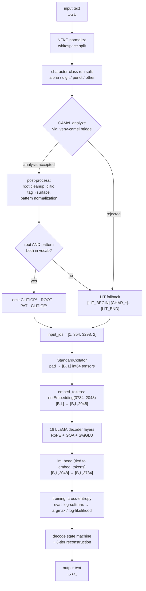

# AraRooPat end-to-end: what happens to `يذهب`

A complete trace of one Arabic word through the AraRooPat tokenizer and the LLaMA-3.2-1B
model — from the raw string, through every internal transformation of the tokenizer, into
the embedding matrix, through the transformer, out as logits, and back to Arabic text.

**Everything in this document is a real measurement**, produced by running the code in this
repo against:

- tokenizer: `outputs/tokenizers/araroopat_balanced` (vocab 3,784)
- model: `outputs/experiments/araroopat_3phase_with_sft/training/sft` (post-Phase-3 checkpoint)
- CAMeL: live `.venv-camel` bridge

No numbers are invented. Where a value looks surprising, [Part 11](#part-11--what-this-trace-exposes)
explains why.

---

## Part 0 — The whole pipeline at a glance



The one-line summary: **AraRooPat turns each analyzable Arabic word into a `(root, pattern)`
token pair, and the model never sees the surface string — only those two discrete
symbols. Decoding is a table lookup that puts the surface string back.**

---

## Part 1 — Before any encoding: how the vocabulary was built

`encode()` cannot be understood without knowing what `train()` produced, because encoding is
mostly *lookup* against structures built at training time.

`AraRooPatTokenizer.train()` ([araroopat.py:169](../src/arabic_eval/tokenizers/araroopat.py#L169))
runs five steps.

### 1.1 Corpus pre-pass

Every distinct **alpha chunk** in the corpus is sent to CAMeL once, in batches of 256, and
the result is cached to `outputs/tokenizers/araroopat_cache/corpus_analysis.pkl`.

Measured on the actual cache in this repo:

```
unique alpha chunks : 1,081,971
analyzed OK         :   297,177  (27.5 %)
rejected → LIT      :   784,794  (72.5 %)
unique roots found  :     3,338
unique patterns     :     8,634
```

### 1.2 Frequency tables

Counters over the accepted entries: `root_freq`, `pat_freq`, `proclitic_freq`,
`enclitic_freq`. Real proclitic counts from `vocab_metadata.json`:

```
و 78,749 · ال 70,073 · ب 31,715 · ل 21,060 · ف 17,273 · la_emph 12,676
ك  9,637 · س  4,798 · la_rc 1,904 · ما 25 · لا 10 · >a_ques 8
```

(`la_emph`, `la_rc`, `>a_ques` are CAMeL feature *tags*, not Arabic surfaces — they were
missing from `CAMEL_CLITIC_SURFACE` and fell through verbatim into the vocabulary. Fixed;
see [Part 11.4](#114-six-vocabulary-entries-were-literal-latin-text-fixed).)

### 1.3 Flat vocab in deterministic ID order

`_build_vocab()` assigns IDs by class, in a fixed order. Measured on the trained tokenizer:

| ID range | Class | Count | First entries |
|---|---|---|---|
| 0–3 | specials | 4 | `<pad>` `<s>` `</s>` `<unk>` |
| 4–5 | literal markers | 2 | `[LIT_BEGIN]` `[LIT_END]` |
| 6–17 | proclitics | 12 | `[CLITICP_و]`(6) `[CLITICP_ال]`(7) `[CLITICP_ب]`(8) … |
| 18–29 | enclitics | 12 | `[CLITICE_ه]`(18) `[CLITICE_ها]`(19) `[CLITICE_هم]`(20) … |
| 30–76 | Arabic chars + diacritics | 47 | `[CHAR_ء]` … `[CHAR_ي]` |
| 77–96 | digits (ASCII + Arabic-Indic) | 20 | `[DIGIT_0]` … `[DIGIT_٩]` |
| 97–137 | punctuation | 41 | `[PUNCT_!]` … `[PUNCT_ـ]` |
| 138–3283 | roots (freq-sorted, ≥2) | 3,146 | `[ROOT_جمع]`(138) `[ROOT_علم]`(139) `[ROOT_عمل]`(140) … |
| 3284–3783 | patterns (freq-sorted, ≥2) | 500 | `[PAT_1َ2ْ3]`(3284) `[PAT_1َ2َ3]`(3285) … |

**Total vocab = 3,784.** Note `max_roots: 10000` in the YAML was never reached — only 3,146
roots occur ≥ 2 times in the corpus. `max_patterns: 500` **was** binding: 6,076 patterns
qualified, 500 were kept. That truncation matters (see [Part 11.2](#112-the-pattern-budget-was-the-real-bottleneck--re-tiered)).

The ID ranges are contiguous by class on purpose: a future constrained decoder can mask
"only ROOT ids are legal here" with a slice, not a set membership test.

### 1.4 The reconstruction table

For every `(root, pattern)` pair observed in the corpus with both tokens in vocab, store the
**inflected stem** — CAMeL's `diac` field minus clitic surface characters, diacritics
stripped (`use_diacritized_surface: false`):

```
reconstruction[(354, 3298)] = "يذهب"          # (ROOT_ذهب, PAT_يَ1ْ2َ3)
```

**60,248 entries** in this tokenizer. This is a dense many-to-many table: root `ذهب` appears
with **58** distinct patterns, and pattern `يَ1ْ2َ3` appears with **360** distinct roots.

```
root ذهب × patterns             pattern يَ1ْ2َ3 × roots
  [PAT_1َ2َ3]     → ذهب          [ROOT_جمع] → يجمع
  [PAT_1ا2ِ3]     → ذاهب         [ROOT_علم] → يعلم
  [PAT_يَ1ْ2َ3]    → يذهب  ←      [ROOT_عمل] → يعمل
  [PAT_تَ1ْ2َ3]    → تذهب         [ROOT_قطع] → يقطع
  [PAT_مَ1ْ2َ3]    → مذهب         [ROOT_دفع] → يدفع
  [PAT_1َ2ا3]     → ذهاب         [ROOT_حفظ] → يحفظ
  [PAT_مَ1ا2ِ3]   → مذاهب        …356 more
  …51 more
```

That grid *is* the compression claim of this tokenizer: 58 + 360 = 418 surface forms are
addressable with 2 ROOT/PAT tokens instead of 418 separate subword entries.

### 1.5 Provenance metadata

```json
"ذهب":     {"id": 354,  "freq": 346,  "source": "corpus",
            "example_words": ["الذهبية","مذهب","تذهب","ذهب","الذهبي"]}
"يَ1ْ2َ3": {"id": 3298, "freq": 1899, "source": "corpus",
            "examples": [["سمح","لِيَسْمَح"],["رغب","يَرْغَب"],["شمل","يَشْمَل"]]}
```

---

## Part 2 — Encoding `يذهب`, transformation by transformation

Entry point: `AraRooPatTokenizer.encode()` ([araroopat.py:502](../src/arabic_eval/tokenizers/araroopat.py#L502)).

### Step 1 — BOS and Unicode normalization

```python
ids  = [1]        # <s>
toks = [""]       # BOS carries no Arabic content (metric string)
text = unicodedata.normalize("NFKC", "يذهب")
```

Two parallel lists are built throughout: `ids` (what the model consumes) and `toks`
(cleaned Arabic surface strings, consumed only by the morphological metrics — *not* the
vocabulary strings).

### Step 2 — Whitespace split, then character-class run split

`_encode_word()` does **not** treat the whitespace word as atomic. It walks it and cuts at
every change of character class (`alpha` / `digit` / `punct` / `space` / `other`):

```
"يذهب"  →  [ ("alpha", "يذهب") ]                      one run
"2024م" →  [ ("digit","2024"), ("alpha","م") ]        two runs
"إلى"   →  [ ("alpha","إل"), ("other","ى") ]          ← ى is not in ARABIC_LETTERS (Part 11.3)
```

`alpha` = the 35 characters of `ARABIC_LETTERS` plus the 12 `ARABIC_DIACRITICS`. Anything
else — Latin letters, `ى`, `ٱ`, emoji — is class `other` and becomes `<unk>` directly.

Our word is a single alpha run, so `_emit_alpha("يذهب")` is called.

### Step 3 — Morphological analysis (crosses a process boundary)

`_emit_alpha` calls `MorphAnalyzer.analyze("يذهب")`, which is an LRU-cached wrapper over the
subprocess bridge. `camel-tools` pins `numpy<2` / `transformers<4.54`, which is incompatible
with `lighteval>=0.11`, so it lives in a separate virtualenv and is reached over NDJSON pipes:

```
main .venv                                     .venv-camel
──────────                                     ───────────
MorphAnalyzer.analyze("يذهب")
  └─ CamelBridge.analyze(["يذهب"])
       stdin  →  {"id":1,"op":"analyze","words":["يذهب"]}
                                                MLEDisambiguator.disambiguate(["يذهب"])
                                                  → dr.analyses  (ScoredAnalysis list)
                                                  → _trim() to 11 fields
       stdout ←  {"id":1,"ok":true,"results":[[ {...} ]]}
```

The raw payload that came back (verbatim, one candidate):

```json
{"root": "ذ.ه.ب", "pattern": "يَ1ْ2َ3", "stem": "ذْهَب", "diac": "يَذْهَب",
 "lex": "ذَهَب", "pos": "verb",
 "prc3": "0", "prc2": "0", "prc1": "0", "prc0": "0", "enc0": "0"}
```

Read the `pattern` field carefully — `يَ1ْ2َ3` means: literal `يَ`, then root letter 1 with
sukun, root letter 2 with fatha, root letter 3 bare. Digits are slots; everything else is
template material. The present-tense `ي` is **inside the pattern**, not a clitic — that
distinction is load-bearing later.

> **The digits are not text.** `1` `2` `3` `4` are CAMeL's positional placeholders for the
> n-th root consonant — the same idea as the classical Arabic *wazn*, which writes the
> template with the model root ف-ع-ل instead of numbers. Substituting `1→ف 2→ع 3→ل` gives the
> familiar form, and the two notations are interchangeable:
>
> | CAMeL slot notation | classical wazn | root | surface |
> |---|---|---|---|
> | `يَ1ْ2َ3` | `يَفْعَل` | ذهب | يذهب |
> | `1َ2َ3َ` | `فَعَلَ` | ذهب | ذهب |
> | `مَ1ْ2َ3` | `مَفْعَل` | ذهب | مذهب |
> | `1ا2ِ3` | `فاعِل` | ذهب | ذاهب |
>
> Verified across the trained vocabulary: **0 of 500 `[PAT_*]` token bodies contain a
> non-Arabic letter** — they are Arabic letters, diacritics, and slot digits only. Six
> *other* vocabulary entries did contain literal Latin text; see [11.4](#114-six-vocabulary-entries-were-literal-latin-text-fixed).

### Step 4 — Post-processing into an `Analysis` (`_dict_to_analysis`)

Five transformations happen in
[araroopat_backend.py:279](../src/arabic_eval/tokenizers/araroopat_backend.py#L279):

| # | Transformation | On `يذهب` |
|---|---|---|
| 1 | Strip root separators `_` `.` `#` | `'ذ.ه.ب'` → `'ذهب'` |
| 2 | Reject if root < 3 letters after stripping | 3 letters — passes |
| 3 | Reject if `root == 'NTWS'` or `'NTWS' in pattern` | not a loanword — passes |
| 4 | Clitic feature tags → Arabic surfaces (`clitic_surface`) | all `"0"` → `None` |
| 5 | `normalize_pattern()` — strip clitic surface chars from the pattern | no clitics → unchanged |

Resulting frozen dataclass:

```python
Analysis(root='ذهب',          pattern='يَ1ْ2َ3',      # bare-stem template
         pattern_raw='يَ1ْ2َ3', stem='ذْهَب',          # CAMeL's LEXICAL stem — note the missing ي
         surface='يَذْهَب',     lemma='ذَهَب', pos='verb',
         prc3=None, prc2=None, prc1=None, prc0=None, enc0=None)
```

> **Why `stem` is not used for reconstruction.** CAMeL's `stem` is `ذْهَب` — the present-tense
> `ي` is gone, because `stem` is the *lexical* stem, not the inflected one. Reconstructing
> from it would decode `يذهب` as `ذهب` and silently destroy the conjugation. AraRooPat
> instead computes `_strip_clitic_surfaces(diac, proclitics, enclitics)` = `يَذْهَب` → strip
> diacritics → `يذهب`. This is Decision §2 in the skill doc, and `يذهب` is exactly the word
> that exposes the bug.

Step 4 in the multi-candidate case: `_first_valid()` walks candidates in MLE score order and
returns the first that survives rules 2–3, so a word whose top analysis is an NTWS loanword
can still be rescued by a lower-scored real analysis.

### Step 5 — Vocabulary lookup and emission

```python
root_tok = "[ROOT_ذهب]"      # in vocab → id 354
pat_tok  = "[PAT_يَ1ْ2َ3]"    # in vocab → id 3298
```

Both present, so the emission order is fixed:

```
for c in (prc3, prc2, prc1, prc0):  emit [CLITICP_c]     # outermost → innermost, none here
emit [ROOT_ذهب]      → 354
emit [PAT_يَ1ْ2َ3]    → 3298
if enc0:            emit [CLITICE_enc0]                  # none here
```

If **either** token were OOV, the whole word would fall through to `_emit_lit` — an
all-or-nothing decision per word.

### Step 6 — The parallel metric strings

`toks` is populated with *cleaned Arabic*, not vocabulary strings, because
`root_conservation_rate` / `pattern_conservation_rate` need to ask "does this token contain
the root letters?":

```python
toks.append(_clean_arabic('ذهب'))                      # → 'ذهب'      for the ROOT token
inflected = _strip_clitic_surfaces('يَذْهَب', (), ())     # → 'يَذْهَب'
toks.append(_clean_arabic(strip_diacritics(inflected))) # → 'يذهب'     for the PAT token
```

So the PAT token's metric string is the *inflected stem* — which is why AraRooPat's
pattern-conservation score is mechanically near its ceiling by construction.

### Step 7 — `TokenizerOutput`

```python
TokenizerOutput(
    input_ids      = [1, 354, 3298, 2],
    attention_mask = [1, 1, 1, 1],
    tokens         = ['', 'ذهب', 'يذهب', ''],       # metric strings
    char_ids       = None,                          # standard embedding: unused
)
```

**4 ids for a 4-character word.** Vocabulary view: `<s> [ROOT_ذهب] [PAT_يَ1ْ2َ3] </s>`.

### Step 8 — The three branches side by side

The same machinery produces very different token streams depending on which branch the word
takes. All three verified by running the trained tokenizer:

```
encode("يذهب")
  ids    [1, 354, 3298, 2]
  vocab  <s> [ROOT_ذهب] [PAT_يَ1ْ2َ3] </s>
  ── clean root+pattern branch, 2 content tokens

encode("ويذهبون")
  raw CAMeL   root='ذ.ه.ب'  pattern='وَيَ1ْ2َ3ُونَ'  prc2='wa_part'  diac='وَيَذْهَبُونَ'
  clitic tag  wa_part → 'و'
  pattern     'وَيَ1ْ2َ3ُونَ' --strip 'و' and its fatha--> 'يَ1ْ2َ3ُونَ'   ← normalize_pattern
  ids    [1, 6, 354, 3423, 2]
  vocab  <s> [CLITICP_و] [ROOT_ذهب] [PAT_يَ1ْ2َ3ُونَ] </s>
  ── same root, different pattern, conjunction split off as its own token

encode("الولد")
  raw CAMeL   root='#.ل.د'   ← '#' = weak/elided root letter
  strip # . _ → 'لد' (2 letters) → REJECTED by rule 2
  ids    [1, 4, 36, 59, 63, 59, 44, 5, 2]
  vocab  <s> [LIT_BEGIN] [CHAR_ا][CHAR_ل][CHAR_و][CHAR_ل][CHAR_د] [LIT_END] </s>
  ── LIT fallback: 7 tokens for a 5-character word
```

Note that `الولد` is a completely ordinary Arabic word. Its trip to the character path is
the single biggest quantitative issue with the current implementation — [Part 11.1](#111-the--weak-root-placeholder-sent-half-the-corpus-to-the-character-path--fixed).

---

## Part 3 — From ids to a batch tensor

`embedding_type == "standard"`, so `get_collator()` returns `StandardCollator` — the same
one BPE and WordPiece use. Nothing about AraRooPat is special here; that's the design goal.

For a training example the pipeline first builds the Phase-3 QA text:

```
السياق: ذهب الولد إلى المدرسة صباحا
السؤال: إلى أين ذهب الولد
الإجابة: المدرسة
```

then tokenizes prompt and full text separately and masks with the LCP helper:

```python
prompt_ids = encode("…الإجابة:").input_ids        # [1, 4, 36, …, 110]
full_ids   = encode("…الإجابة: المدرسة").input_ids
labels     = compute_answer_only_labels(prompt_ids, full_ids)
#            → [-100]*lcp + full_ids[lcp:]
```

LCP rather than `labels[:len(prompt)] = -100`, because `prompt_ids` ends with `</s>` (id 2)
while `full_ids` has the first answer token at that index. Walking in lockstep until the
first divergence gets the boundary right for any tokenizer.

The collator then pads to the batch max and produces:

```
input_ids      int64 [B, L]      pad = 0
attention_mask int64 [B, L]      1 on real tokens
labels         int64 [B, L]      -100 on prompt span and padding
```

---

## Part 4 — Into the model: the embedding matrix

### 4.1 The resize, and what it silently inherits

`LlamaAdapter.adapt_to_tokenizer()` sees `EmbeddingType.STANDARD` and calls
`resize_token_embeddings(model, 3784)`. LLaMA-3.2-1B ships with `vocab_size = 128256`, so
this is a **shrink**, and HuggingFace's shrink keeps the **first 3,784 pretrained rows**:

```
new_vocab_size (3784) < old_vocab_size (128256)
  → no reinitialization fires
  → row i of the new matrix IS row i of pretrained LLaMA
```

Which means, before any training:

| AraRooPat token | id | inherits the pretrained embedding of LLaMA's… |
|---|---|---|
| `<s>` | 1 | `"` |
| `[LIT_BEGIN]` | 4 | `%` |
| `[CHAR_ا]` | 36 | `E` |
| `[ROOT_ذهب]` | 354 | `ot` |
| `[PAT_يَ1ْ2َ3]` | 3298 | `ĠAct` |

There is nothing meaningful about that alignment — it is an index collision. **Phase 1
(embedding alignment) exists precisely to drift these rows into something usable**, which is
why Phase 1 trains `embed_tokens` with the body frozen at a 5× higher learning rate than the
other phases.

### 4.2 The matrix after training

Measured on the Phase-3 checkpoint:

```
embed_tokens.weight : (3784, 2048)  bfloat16      ≈ 7.75 M parameters
lm_head.weight is embed_tokens.weight : True      ← tied
"lm_head" in named_parameters()       : False     ← the tied-weight warning in freezing.py

E[1]    <s>            ‖v‖ = 0.9319   [ 0.0205, -0.0239,  0.0298, -0.0228, …]
E[354]  [ROOT_ذهب]     ‖v‖ = 1.1228   [-0.0092, -0.0187, -0.0160, -0.0265, …]
E[3298] [PAT_يَ1ْ2َ3]   ‖v‖ = 1.1613   [-0.0018,  0.0072,  0.0081,  0.0215, …]
```

Because the weights are tied, the **same 2048-dim vector** is both "what the model reads when
it sees `[ROOT_ذهب]`" and "the direction it must produce to predict `[ROOT_ذهب]`".

### 4.3 The lookup itself

```
input_ids [1, 4]        →   embed_tokens   →   inputs_embeds [1, 4, 2048]
[1, 354, 3298, 2]                              4 rows gathered from a (3784, 2048) matrix
```

That is the entire embedding stage: a gather. All of AraRooPat's morphological work happened
*before* this point, in the tokenizer. Contrast with Charformer, where the "tokenizer" is a
learned module inside the model — here the model is completely unmodified apart from the
matrix size.

---

## Part 5 — The transformer

Nothing is customized. `LlamaAdapter.forward()` takes the non-character branch and calls the
stock HF forward:

```python
outputs = self._model(input_ids=..., attention_mask=..., labels=...)
```

LLaMA-3.2-1B, as loaded:

```
hidden_size 2048 · layers 16 · attention heads 32 · KV heads 8 (GQA) · head_dim 64
intermediate 8192 (SwiGLU) · RMSNorm eps 1e-5 · RoPE theta 500000 · tie_word_embeddings true
```

Measured on a real 74-token prompt:

```
hidden_states[0]   (1, 74, 2048)     embeddings
hidden_states[-1]  (1, 74, 2048)     after 16 decoder layers + final norm
logits             (1, 74, 3784)     ← vocabulary is AraRooPat's, not LLaMA's
```

Each of the 16 layers applies causal self-attention with RoPE followed by a SwiGLU MLP. Since
AraRooPat is `standard`, the sequence length is untouched — no downsampling, no mask surgery,
no upsampling output head.

**What position means here.** The model's positional structure now indexes *morphological
slots*, not orthographic ones. In `[ROOT_ذهب] [PAT_يَ1ْ2َ3]`, position *t* is a semantic
skeleton and position *t+1* is a morphosyntactic template. The model has to learn the
bigram grammar "a ROOT is followed by a PAT" — and it does, measurably (Part 6).

---

## Part 6 — Logits, and what the trained model actually predicts

`lm_head` (tied) projects `[1, 74, 2048] → [1, 74, 3784]`. Real top-8 for the next token
after the prompt `…\nالسؤال: إلى أين ذهب الولد\nالإجابة:` — greedy, Phase-3 checkpoint:

```
id  3320  [PAT_1َ2َ3َ]        logprob  -0.3250   p = 0.7225
id  3299  [PAT_يَ1ْ2ُ3]       logprob  -1.5750   p = 0.2070
id  3306  [PAT_مَ1ْ2َ3]       logprob  -4.8250   p = 0.0080
id   330  [ROOT_نشط]         logprob  -4.8875   p = 0.0075
id  3590  [PAT_مَ1ا2ِ3ِ]      logprob  -4.9500   p = 0.0071
id   657  [ROOT_نهر]         logprob  -5.7625   p = 0.0031
id   426  [ROOT_شرق]         logprob  -5.8250   p = 0.0030
id   364  [ROOT_شمل]         logprob  -5.8250   p = 0.0030
```

Three things worth reading off this distribution:

1. **94 % of the top-8 mass sits on PAT tokens.** The model learned the class-level grammar
   of the vocabulary — the ID-range structure of Part 1.3 shows up in the output
   distribution.
2. **It is a PAT with no preceding ROOT.** The prompt's last two tokens are `[PUNCT_:] </s>`,
   so this is an *orphan pattern*. The decode state machine absorbs it (Part 9), but it shows
   the ROOT→PAT bigram is not perfectly enforced by the LM alone.
3. **The prompt ends with `</s>`.** `encode()` appends EOS unconditionally, including to a
   bare prompt — which is precisely why answer-only masking must use LCP rather than
   `labels[:len(prompt)] = -100` (Part 3).

Greedy continuation, then decoded:

```
generated ids   [3320, 4, 36, 59, 63, 59, 44, 5, 4, 36]
generated toks  [PAT_1َ2َ3َ] [LIT_BEGIN] [CHAR_ا][CHAR_ل][CHAR_و][CHAR_ل][CHAR_د] [LIT_END] [LIT_BEGIN] [CHAR_ا]
decode(...)     'الولد'
```

---

## Part 7 — How those ids become gradients (the 3-phase pipeline)

Identical for every tokenizer in the platform; only the vocabulary differs. Real per-phase
results from `all_metrics.json` for this experiment:

| Phase | Trains | Data | Loss | Steps | Final train loss | Wall |
|---|---|---|---|---|---|---|
| 1 `embedding_alignment` | `embed_tokens` (+ tied `lm_head`) only, body frozen | Arabic-SQuAD | full-sequence CE | 1000 | 1.5933 | 61 s |
| 2 `warmup` | all | Arabic-SQuAD | answer-only CE | 2000 | 1.6159 | 300 s |
| 3 `sft` | all | TyDiQA-ar + ARCD | answer-only CE | 2000 | 0.2708 | 253 s |

Phase 3 best eval loss 0.4244 at step 1800 (no early stop).

What Phase 1 does to `[ROOT_ذهب]`: at step 0 the row is LLaMA's `'ot'` embedding. Every time
`ذهب` appears in an Arabic-SQuAD sequence, cross-entropy pushes row 354 toward a direction
that (a) predicts plausible successors as an input, and (b) is predictable from left context
as an output — both at once, because of weight tying. The body is frozen so *only* those
7.75 M parameters move; the transformer's Arabic competence stays intact while the
vocabulary is re-grounded.

---

## Part 8 — Evaluation path (no generation required)

Downstream benchmarks are scored by log-likelihood, not decoding
(`_compute_loglikelihood` in [tasks/lighteval/base.py](../src/arabic_eval/tasks/lighteval/base.py)):

```python
full = context + continuation
ctx_len, full_len = len(encode(context)), len(encode(full))
logits    = model.forward({...})["logits"]
log_probs = log_softmax(logits[0], -1)
ll = Σ_{pos = ctx_len-1 … full_len-2}  log_probs[pos, full_ids[pos+1]]
```

Then char-norm and/or PMI normalization, then argmax over the choices. Real results for this
experiment:

| Task | rows | accuracy (PMI) | char-norm | inference |
|---|---|---|---|---|
| ACVA | 9,000 | 0.5571 | 0.5901 | 474 s |
| Alghafa | 22,977 | 0.3642 | 0.3668 | 587 s |
| Arabic-Exam | 14,455 | 0.2862 | 0.3145 | 240 s |

MEI (accuracy × RPS × compression per row-second): ACVA 1.835 · Alghafa 2.472 · Arabic-Exam 2.984.
RPS here is 0.1696, so MEI is dragged down by the same coverage problem as everything else.

---

## Part 9 — Decoding: the state machine and the three-tier resolver

`decode()` is a single left-to-right pass with four pieces of state:

```
out           finalized words, in order
clitic_prefix buffered proclitics waiting for the next content word
pending_root  a ROOT that has not yet met its PAT
lit_buffer    characters accumulating between LIT_BEGIN and LIT_END
```

Dispatch is on the token's **string prefix** — which is why proclitics and enclitics have
distinct prefixes rather than a shared `[CLITIC_*]`: the decoder must know, from the token
alone, whether a `ك` attaches leftward or rightward.

Trace of `[1, 6, 354, 3423, 2]` (`ويذهبون`):

| token | branch | state after |
|---|---|---|
| `<s>` (1) | skipped (pad/bos/eos) | — |
| `[CLITICP_و]` (6) | `clitic_prefix.append('و')` | prefix=`['و']` |
| `[ROOT_ذهب]` (354) | `dump_orphan_root()`; `pending_root='ذهب'` | pending=`ذهب` |
| `[PAT_يَ1ْ2َ3ُونَ]` (3423) | `_reconstruct(354, 3423, …)` → `يذهبون`; `flush_word` prepends `'و'` | out=`['ويذهبون']` |
| `</s>` (2) | skipped | — |

Result: `"ويذهبون"` — exact roundtrip.

### The three tiers of `_reconstruct`

```
Tier 1  self._reconstruction[(354, 3298)]        → 'يذهب'        O(1) dict hit
Tier 2  backend.generate('ذهب', 'يَ1ْ2َ3')          → CAMeL rules   ~1 ms, cached
Tier 3  naive_pattern_fill('ذهب', 'يَ1ْ2َ3')        → 'يَذْهَب'      pure substitution
```

Tier 2 is subtle: CAMeL's `Generator` takes a *lemma + features*, not a `(root, pattern)`
pair, which we don't have for an unseen combination. So the server naive-fills, re-analyzes
the rough form, and returns the `stem` of whichever analysis matches the target
`(root, bare_pattern)` — exploiting the analyzer as a lossy inverse of the generator. That is
what recovers `قال` instead of tier 3's `قَوَلَ` for weak roots.

For `يذهب`, tier 1 hits and tiers 2–3 never run — the expected case for ~99 % of LLM
emissions, since the LM was trained on exactly this pair distribution.

### Edge cases the machine absorbs

| Situation | Handling |
|---|---|
| PAT with no pending ROOT (observed in Part 6!) | `naive_pattern_fill("", pat)` returns `""` (guard on empty root) → word vanishes silently |
| ROOT with no following PAT | `dump_orphan_root()` emits the bare root letters as a word |
| Consecutive `[DIGIT_*]` | glued into one number if the previous output ends in a digit and no proclitic is buffered — so `2 0 2 4` → `2024` |
| Trailing buffered proclitics at EOS | flushed as a standalone word |
| `<unk>` | emitted as `?` |

---

## Part 10 — The full round trip for `يذهب`

```
INPUT            يذهب
  NFKC           يذهب
  runs           [alpha:"يذهب"]
  CAMeL raw      root='ذ.ه.ب'  pattern='يَ1ْ2َ3'  diac='يَذْهَب'  stem='ذْهَب'  prc/enc all "0"
  post-process   root='ذهب'  pattern='يَ1ْ2َ3'  clitics=()
  vocab lookup   [ROOT_ذهب]→354   [PAT_يَ1ْ2َ3]→3298
TOKENS           <s> [ROOT_ذهب] [PAT_يَ1ْ2َ3] </s>
IDS              [1, 354, 3298, 2]
MASK             [1, 1, 1, 1]
METRIC TOKENS    ['', 'ذهب', 'يذهب', '']
  ↓ collate      input_ids[B,4] · attention_mask[B,4] · labels[B,4]
  ↓ embed        gather 4 rows of (3784, 2048)   →  [B, 4, 2048]
  ↓ 16 layers    RoPE + GQA + SwiGLU             →  [B, 4, 2048]
  ↓ lm_head(tied)                                →  [B, 4, 3784]
  ↓ CE loss / log-softmax
  ↓ decode       354 → pending_root='ذهب'
                 3298 → reconstruction[(354,3298)] = 'يذهب' → flush
OUTPUT           يذهب                                       ✓ exact
```

---

## Part 11 — What this trace exposes

> **Status (2026-08-30).** Every defect below has been acted on. The trace in Parts 0–10 is a
> faithful record of `outputs/tokenizers/araroopat_balanced` (vocab 3,784) and is left
> unchanged — it is the "before" artifact. The fixed tokenizer is
> `outputs/tokenizers/araroopat_hashfix` (vocab 8,265); the ablation with the `#` fix but the
> old pattern budget is `araroopat_hashfix_p500`. Headline result: the share of words reaching
> the root+pattern path went **22.1 % → 48.2 %** and fertility **5.76 → 4.47**. See
> [11.6](#118-outcome) for the full before/after.

The measurements above surface four concrete issues. They are diagnoses, not speculation —
each has a number attached. **Nothing was changed in the code**; this section is a record of
what the walkthrough revealed.

Token-class distribution over 300 real Arabic-Exam questions (2,556 whitespace words,
13,879 tokens, fertility 5.43):

```
[CHAR_*]     7,254   52.3 %  ┃████████████████████████████
[LIT_*]      3,948   28.4 %  ┃███████████████
[ROOT_*]       565    4.1 %  ┃██
[PAT_*]        565    4.1 %  ┃██
[PUNCT_*]      446    3.2 %  ┃█
[CLITICP_*]    323    2.3 %  ┃█
<s>/</s>       600    4.3 %  ┃██
<unk>          125    0.9 %  ┃
[CLITICE_*]     33    0.2 %  ┃
[DIGIT_*]       20    0.1 %  ┃
```

**Only 22 % of words reach the root+pattern path.** Four out of five words are spelled out
character by character. Why, decomposed over the same sample:

```
rejected: '#' weak-root placeholder   1,249   49.3 %   سور القرآن في أي الأيام سيدنا آدم عليه
accepted → ROOT+PAT                     803   31.7 %   عدد الكريم خلق السلام نام الكهف صحابي
rejected: root < 3 letters              435   17.2 %   كم هي من أطول
rejected: NTWS (loanword/proper noun)    48    1.9 %   مريم يوسف قابيل إبراهيم جبريل
```

(31.7 % accepted by CAMeL, but 22.2 % actually emitted as ROOT+PAT — the 9.4 % gap is the
pattern-budget truncation, 11.2 below.)

### 11.1 The `#` weak-root placeholder sent half the corpus to the character path — fixed

`_dict_to_analysis` stripped `#` alongside `_` and `.`, then rejected roots under 3 letters.
But CAMeL uses `#` to mark **a radical whose surface realization is not stable across the
paradigm** — the weak letters و/ي/ا and the hamza family. It is a radical, not a missing field:

```
سور      root='س.#.ر'    → 'سر'  (2)  → REJECTED
القرآن   root='ق.ر.#'    → 'قر'  (2)  → REJECTED
في       root='ف.#'      → 'ف'   (1)  → REJECTED
الأيام   root='#.#.م'    → 'م'   (1)  → REJECTED
الولد    root='#.ل.د'    → 'لد'  (2)  → REJECTED
```

It is a property of the **lexeme's root**, not the surface form — قال · يقول · قول · أقوال ·
مقال all analyse as `ق.#.ل` — and it is **complementary to the pattern**: the masked radical's
slot digit is absent from the pattern and the letter that surfaces sits there as literal
template material (`1ا3َ`, `يَ1ُو3`, `1َوْ3ِ`). Verified across the corpus: **457 of 457** masked
radicals have their slot missing from the pattern, zero counter-examples.

Deleting it was destructive twice over: the root fell below the 3-radical bar, *and* the
remaining radicals were renumbered so the pattern's slot digits no longer indexed the right
letters. It cost **49.3 % of word occurrences**.

**Fix:** count radicals structurally (`root.split(".")`) and keep the placeholder in the token
(`[ROOT_ق#ل]`). `WEAK_RADICAL_MARK` is whitelisted by `_is_arabic_root`, guarded against in
`naive_pattern_fill`, and the server's `_op_generate` normalization was brought back into sync
(had it not been, every tier-2 reconstruction would have silently degraded to tier-3).

Measured effect on the pre-pass: analyzed types **297,177 → 506,101** (27.5 % → 44.4 %), unique
roots 3,338 → 4,331.

**Known trade-off — `#` is lossy.** `[ROOT_س#ر]` covers both س-و-ر (سور, wall) and س-ي-ر (سار,
walk); `ص.#.م` covers صوم and صام. The `(root, pattern)` *pair* stays unambiguous because the
pattern carries the realized letter, but the root token alone does not. Canonicalizing `#` to a
guessed radical was rejected: it merges exactly the same pairs while hiding the ambiguity
behind a plausible-looking root.

### 11.2 The pattern budget was the real bottleneck — re-tiered

`max_patterns: 500` against 6,076 patterns clearing `min_pattern_freq: 2`. Emission is
all-or-nothing per word: an out-of-vocab pattern discards the root with it.

Fixing `#` made this **worse**, and that is the interesting part. Keeping the masked radical
moves the weak letter's identity out of the root and into the pattern, so the pattern inventory
grew **8,634 → 21,578** unique (15,219 at freq ≥ 2) while unique roots barely moved. The `#`
fix alone therefore delivered almost nothing:

| | ROOT+PAT path | fertility | vocab |
|---|---|---|---|
| before (`#` stripped, 500 patterns) | 22.1 % | 5.43 | 3,784 |
| `#` kept, still 500 patterns | 26.1 % | 5.32 | 4,765 |
| `#` kept, 4,000 patterns | **48.2 %** | **4.39** | 8,265 |

Admission as a function of the budget, measured on 300 real Arabic-Exam questions (CAMeL
analyses 66.6 % of occurrences — the ceiling for any budget):

```
patterns   500 → 26.2 %      patterns  2000 → 42.2 %      patterns  6076 → 52.1 %
patterns  1000 → 33.6 %      patterns  4000 → 48.2 %  ← default
```

Raising `max_roots` 10,000 → 15,000 changes nothing: only 4,128 roots clear `min_root_freq`,
so the roots allowance was never binding. `configs/tokenizers/araroopat.yaml` is re-tiered
accordingly (Balanced = 10,000 roots + 4,000 patterns).

### 11.3 `ى` (alef maqsura) is not in `ARABIC_LETTERS`, so it becomes `<unk>`

```python
ARABIC_LETTERS = set("ابتثجحخدذرزسشصضطظعغفقكلمنهويءأإآؤئة")   # 35 chars — no ى, no ٱ
```

`_classify_char('ى')` → `other` → `<unk>`, *and* the run split cuts the word in two:

```
encode("إلى المستشفى")
  <s> [LIT_BEGIN][CHAR_إ][CHAR_ل][LIT_END] <unk> [LIT_BEGIN][CHAR_ا]…[CHAR_ف][LIT_END] <unk> </s>
decode(...)  →  'إل ? المستشف ?'
```

`normalize_arabic()` in [data/preprocessing.py](../src/arabic_eval/data/preprocessing.py)
normalizes alef *variants* (`آأإٱ → ا`) but does not map `ى → ي`, so nothing upstream rescues
it. Since `ى` ends إلى / على / حتى and every defective-root noun, it also means those words
are truncated *before* CAMeL ever sees them — contributing to 11.1's rejection rate. This is
also the source of the 0.9 % `<unk>` rate and the `vocab_coverage = 0.9311` in the intrinsic
metrics.

### 11.4 Six vocabulary entries were literal Latin text (fixed)

Two independent leaks put non-Arabic strings into the vocabulary:

**Untranslated clitic feature tags.** `clitic_surface()` returns the CAMeL tag verbatim when
it is missing from `CAMEL_CLITIC_SURFACE`, so the tag itself became the token:

| token | occurrences | correct surface |
|---|---|---|
| `[CLITICP_la_emph]` | 12,676 | `ل` — lam of emphasis |
| `[CLITICP_la_rc]` | 1,904 | `ل` — lam of the result clause |
| `[CLITICP_>a_ques]` | 8 | `أ` — interrogative alif (`>` is Buckwalter for `أ`) |
| `[CLITICE_mA_sub]` | 6 | `ما` — subordinating *mā* |

`la_emph` alone is more frequent than `س` (4,798) and `لا` (10) combined.

**Root-field markers that the NTWS guard missed.** `_dict_to_analysis` rejected `root='NTWS'`
but not CAMeL's other non-word markers:

```
[ROOT_FOREIGN]  freq 61   from دورهٔ · ردهٔ · هزمٓ · قلٕ   (Persian/rare orthography)
[ROOT_Uٌٍ]       freq  3   from هيكتور · وهيكتور · لهيكتور  (Hector — an ASCII fragment)
```

**Fix applied** in [araroopat_backend.py](../src/arabic_eval/tokenizers/araroopat_backend.py)
and mirrored into the server's duplicated table
([araroopat_camel_server.py](../src/arabic_eval/tools/araroopat_camel_server.py)):

1. the four tags added to `CAMEL_CLITIC_SURFACE` and bucketed into
   `_PROCLITIC_TAGS` / `_ENCLITIC_TAGS`;
2. `FOREIGN` rejected alongside `NTWS`;
3. a catch-all `_is_arabic_root()` guard — a root must be Arabic letters only, so any future
   ASCII/Buckwalter fragment routes to LIT instead of becoming a token;
4. the unknown-tag fallthrough kept (it is deliberate graceful degradation) but promoted from
   `logger.debug` to `logger.warning`, so the next leak is visible rather than silent.

Verified: `دورهٔ`, `هيكتور` now fall back to LIT; `يذهب` and `والكتاب` analyse unchanged; the
full test suite (292 tests) passes. **The saved `araroopat_balanced` vocabulary still contains
the six tokens — the fix takes effect the next time the tokenizer is trained.**

### 11.5 How this shows up in the intrinsic metrics

The recorded numbers for the "before" tokenizer, which otherwise look contradictory:

```
fertility                    5.7627    ← 5.8 tokens per word: the LIT character path
compression_ratio            1.0218    ← ~1 char per token: same cause
root_conservation_rate       0.1996    ← only 22 % of words even get a ROOT token
pattern_conservation_rate    0.2296
morpheme_integrity_rate      1.0       ← see 11.6: measured on the fallback path only
clitic_separation_accuracy   1.0       ← same
semantic_fragmentation_ratio 3.5820    ← 3.6 tokens per Farasa morpheme: over-fragmented
unk_rate                     0.0102    ← the ى problem
vocab_coverage               0.9445
```

RPS does not measure one thing. It is `P(morphological path fires) × P(root survives | fired)`,
normalized by a denominator that includes words no tokenizer can win. For araroopat the first
factor dominated, so 0.1996 was a coverage number wearing a conservation number's name.

### 11.6 The metric itself was measuring the wrong population — fixed

Two of the four headline metrics require `aligned_token_offsets` to succeed, which needs the
cleaned tokens to concatenate back into the source word. araroopat's ROOT+PAT output never
does — it emits a root plus an inflected stem, not a cover of the word:

```
words routed to LIT : 488  → alignment succeeds 488, fails   0
words with ROOT+PAT : 112  → alignment succeeds   0, fails 112
```

So `morpheme_integrity_rate = 1.0` and `clitic_separation_accuracy = 1.0` were computed
**exclusively on the character-fallback path**, where every character boundary trivially aligns
with every morpheme boundary. The earlier explanation in CLAUDE.md ("≈ 1.0 by construction,
clitics are separate tokens") was not the actual cause.

`compute_morphological_metrics` now emits five diagnostics that make the headline numbers
readable — each headline metric has a ceiling that is a property of the *sample*, not the
tokenizer:

| field | says |
|---|---|
| `root_measurable_pct` | share of sampled words whose root is a subsequence of the *unsplit* word — ~84 %, so a raw RPS of 1.0 is unreachable (قال does not contain the و of قول) |
| `root_conservation_attainable` | RPS renormalized onto that reachable population — the comparable number |
| `morph_alignment_coverage` | share of words integrity/CSA actually saw |
| `morph_alignment_ceiling` | what a whole-word tokenizer scores — 0.6202, capped by `clean_token_string` dropping `ى`/`ٱ`; `character_bert` and `char_jaber` sit exactly on it |
| `root_extractor_agreement` | qalsadi vs tashaphyne, ~0.80 — noise in the ground truth, not in any tokenization |

`generate_report` renders a *Morphological Metrics* section and footnotes any experiment below
`LOW_ALIGNMENT_COVERAGE` (0.5) — report-and-footnote, never suppression.

The diagnostic immediately earned its place: after the fix, `morph_alignment_coverage` **fell
0.4292 → 0.2232** while integrity and CSA both kept printing 1.0. Moving words onto the
root+pattern path removes them from the only population those two metrics can see.

### 11.7 The لِ + الـ contraction corrupted patterns and decode — fixed

Surfaced by the extra traffic the `#` fix put on the morphological path, but **pre-existing and
independent of it** — it hits sound roots too.

Arabic writes one lam, not two, when the preposition لِ meets the article: لِ + الوَلَد → لِلوَلَد.
So the article's surface in `لِلكِتابِ` is `ل`, not `ال`, and a literal strip of `ال` silently
failed, leaving a stray lam in both artifacts:

```
للكتاب   raw pattern 'لِل1ِ2ا3ِ'   → bare pattern 'ل1ِ2ا3ِ'   (should be '1ِ2ا3ِ')
                                     inflected stem 'لكتاب'    (should be 'كتاب')
```

Two costs. The pattern vocabulary carried a duplicate `ل`-prefixed variant of every template —
**2,608 of 21,578 unique patterns, 12 % of the inventory** — which is expensive now that the
pattern budget is the binding constraint. And decode reassembled the clitics naively, so
`للولد` came back as `لالولد`.

Fixed on both sides, and they must stay inverse: `strip_proclitics_from_start` (encode,
mirrored into the server's `_normalize_pattern`) and `join_proclitics` (decode).
`الكتاب` · `لكتاب` · `للكتاب` · `بالكتاب` now all reduce to the same bare pattern `1ِ2ا3ِ` and the
same stem — which is precisely what decoupling clitics is supposed to achieve.
Regression tests: [tests/test_araroopat_normalization.py](../tests/test_araroopat_normalization.py).

### 11.8 Outcome

Same corpus, same 300 real Arabic-Exam questions, same word sample.

| | before | after | |
|---|---|---|---|
| vocab size | 3,784 | 8,265 | |
| words on the ROOT+PAT path | 22.1 % | **48.2 %** | +118 % |
| tokens that are `[CHAR_*]` | 52.3 % | 37.5 % | |
| fertility | 5.7627 | **4.4688** | −22 % |
| compression_ratio | 1.0218 | **1.3176** | +29 % |
| root_conservation_rate | 0.1996 | **0.3541** | +77 % |
| root_conservation_attainable | 0.2321 | **0.4071** | +75 % |
| pattern_conservation_rate | 0.2296 | 0.3969 | +73 % |
| semantic_fragmentation_ratio | 3.5820 | 2.9388 | −18 % |
| root_bearing_token_pct | 8.10 | 15.84 | |
| morph_alignment_coverage | 0.4292 | 0.2082 | ↓ by design (11.6) |
| analyzed types in the pre-pass | 297,177 (27.5 %) | 506,101 (44.4 %) | |
| unique patterns in the corpus | 8,634 | 18,970 | |
| reconstruction entries | 60,248 | 108,149 | |

The ablation matters: the `#` fix **alone**, at the old 500-pattern budget, moved the path from
22.1 % to only 26.1 %. Fixing the analyzer without re-tiering the budget looks like a failed fix.

Still on the table: CAMeL analyses 66.6 % of word occurrences, and the tokenizer admits 47.8 %.
The remaining ~19-point gap is pattern-budget truncation, which buys diminishing returns
(6,076 patterns → 52.1 % for a 10.3K vocab). The other 33.4 % is CAMeL's backoff analyzer
(`root='O'`, `pattern='backoff'`) firing on words with no database entry — not addressable by
any budget.

**Not yet measured: whether any of this improves downstream accuracy.** That needs the full
3-phase pipeline (~5 h on an H100) against the archived `araroopat_3phase_with_sft` run.


---

## Appendix — Reproducing this trace

```bash
# raw CAMeL candidates + post-processed Analysis + encode/decode
.venv/bin/python - <<'PY'
import sys; sys.path.insert(0, "src")
from arabic_eval.tokenizers.araroopat_bridge import get_shared_bridge
from arabic_eval.tokenizers.araroopat_backend import _dict_to_analysis
from arabic_eval.tokenizers.araroopat import AraRooPatTokenizer

print(get_shared_bridge().analyze(["يذهب"])[0])
tok = AraRooPatTokenizer(); tok.load("outputs/tokenizers/araroopat_balanced")
out = tok.encode("يذهب")
print(out.input_ids, [tok._reverse_vocab[i] for i in out.input_ids], tok.decode(out.input_ids))
PY

# corpus-level coverage numbers
.venv/bin/python -c "
import pickle
e = pickle.load(open('outputs/tokenizers/araroopat_cache/corpus_analysis.pkl','rb'))
print(len(e), sum(1 for x in e if x.analyzed))"
```

Slide deck of Part 10: [araroopat_roundtrip.pptx](araroopat_roundtrip.pptx), regenerated by
`.venv/bin/python docs/araroopat_roundtrip_deck.py`.

Artifacts: `araroopat_balanced` (before) · `araroopat_hashfix_p500` (`#` fix only, ablation) ·
`araroopat_hashfix` (before+budget, current default). Rebuild with
`.venv/bin/python scripts/train_tokenizer.py --type araroopat --params '{"max_patterns": 4000}'`.

Related reading: [CLAUDE.md](../CLAUDE.md) (platform architecture) ·
`.claude/skills/araroopat/SKILL.md` (design decisions and rejected alternatives).
